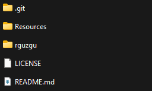
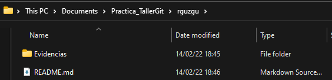

# Taller de Introducción a Git

¡Felicidades por haber terminado el Taller de Introducción a Git! 
En esta práctica pondrás a prueba tus nuevos conocimientos sobre el manejo de repositorios de Git y la creación de documentos utilizando Markdown.

En caso de tener alguna duda puedes consultar el archivo [Git_Markdown_Cheatsheet.md](Git_Markdown_Cheatsheet.md) que se encuentra en el repositorio o puedes realizar una pregunta en el canal de `#git-raúl` de Discord.

¿Qué es lo que deberás de hacer para esta práctica?

## Pasos iniciales de la práctica
1. Realiza un fork de este repositorio
1. Clona el fork que realizaste a tu computadora.
1. En la raíz del repositorio, crea una nueva carpeta que tenga el mismo nombre que tu nombre de usuario de Discord. Esta será tu **carpeta de trabajo** y en ella almacenarás los archivos de la práctica.
    - Suponiendo que tu nombre de usuario de Discord es `rguzgu`, tu **carpeta de trabajo** tendrá el nombre de `rguzgu`:
    
1. Crea una nueva rama que se llame `gitignore`. Deberás de quedarte con dos ramas en tu repositorio: `main`, `gitignore`.

## Cosas que se realizarán en la rama `main`
1. Dentro de la carpeta creada en el paso 3, crea una carpeta llamada evidencias. En esta carpeta almacenarás evidencias de los comandos de git que utilizaste en la práctica, trata de agregar al menos **3 evidencias**.
2. Copia dentro de la carpeta creada en el paso 3 el archivo _README.md_ que estuvimos usando en el taller y síguelo modificando. Agrega más hobbies, más imágenes, links a algún video que te guste, describe lo que te gustaría aprender, lo que estas aprendiendo actualmente, no lo sé, ¡el cielo es el limite!. Las modificaciones que hagas en la rama al README deben de estar contenidas en al menos **3 commits diferentes**.

- Al terminar esta parte de la práctica, la carpeta creada en el paso 3 se deberá de ver así:  

## Cosas que se realizarán en la rama `gitignore`
1. Descarga de [aquí](drive.google.com) los archivos que utilizarás para esta parte de la práctica. Extrae los archivos y ponlos en la raíz del repositorio.
2. Crea un archivo gitignore que ignore los siguientes archivos:
    - ContraseñaSuperImportante.txt
    - Todos los archivos dentro de la carpeta PerfilesUsuario
    - Todos los archivos con extensión .env

## Pasos finales de la práctica
1. Realiza un merge de la rama `gitignore` con la rama `main`.
1. Haz pull desde la rama main para subir tus cambios a la copia de tu repositorio en GitHub.
1. Crea un Pull Request de la rama `main` de tu repositorio a la rama `main` de este repositorio
1. En la Pull Request te comentaré si es necesario que realices alguna modificación a tu práctica. Si no hay ningún cambio por realizar aceptaré la Pull Request
1. Si acepté la Pull Request eso significa que la práctica está terminada. 😎

**¡Mucha suerte en su práctica!✌️**